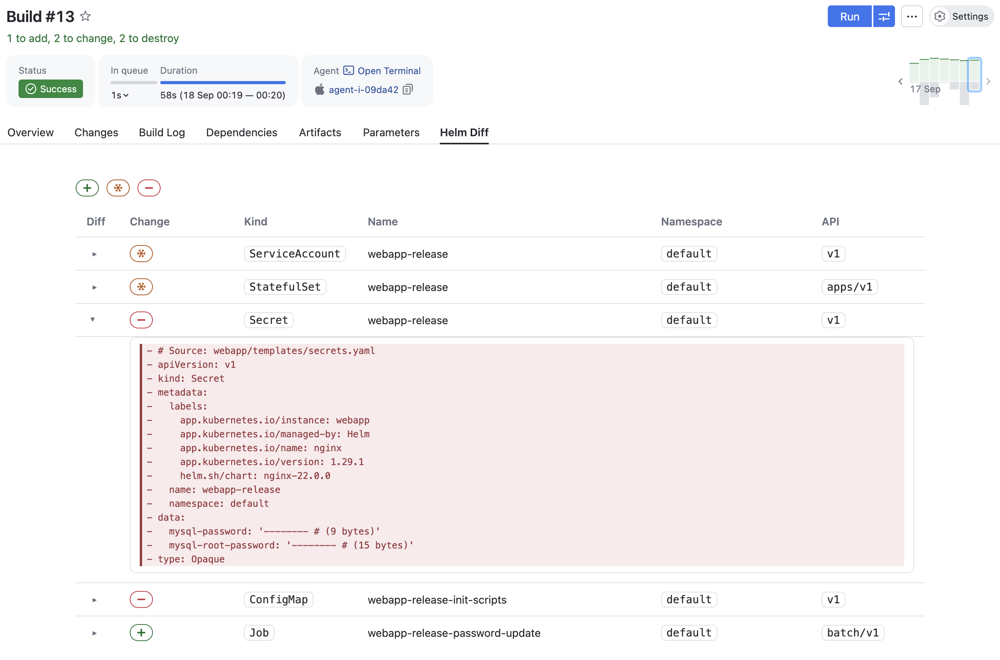
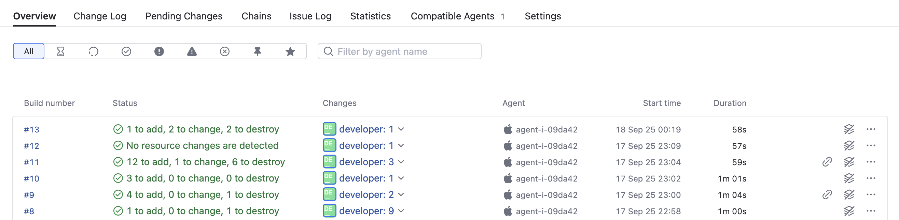
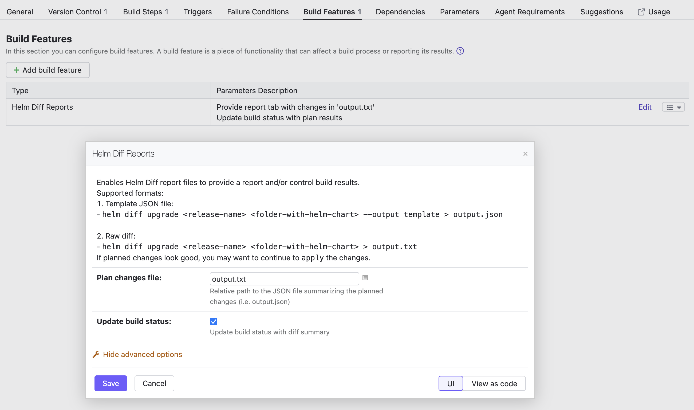

# Helm Reports for TeamCity

This project aims to provide a simple Helm-related build feature for TeamCity. 

The key features are:
- provide the report tab showing detected changes
- update the build status with the count of detected changes

### Example of the report tab


### Example of the build status in the Overview page


The plugin targets a scenario where `terraform` is executed in a build chain; dependency build provides a plan file, and dependent build applies it. The build feature provided by plugin allows to control the changes introduced in plan file, review them easier and fail the plan build if necessary.
Synergises with [Manual Approval](https://www.jetbrains.com/help/teamcity/build-approval.html) feature introduced in 2022.04. 

# How to use

- add build feature "Helm Diff Reports" to your build configuration.
  - there one can specify the output file to detect in two formats: txt or json
  - the suitable txt format is generated by helm-diff plugin by default and json format with flag `--output template`
  - additionally, one can enable the update of the build status with the detected changes



- configure build-step to generate necessary diff file
```
helm diff > output.txt
# OR
helm diff --output template > output.json
```

- enjoy reports!
